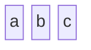
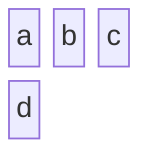
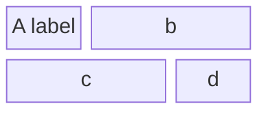
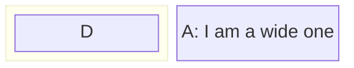
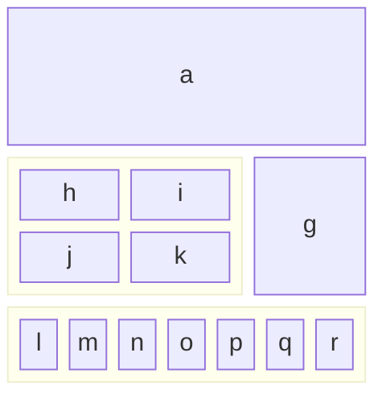
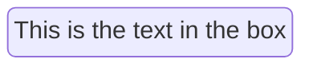
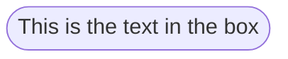
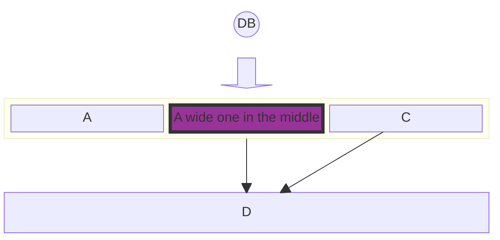

## Syntax

At its core, a block diagram consists of blocks representing different entities or components. In Mermaid, these blocks are easily created using simple text labels. The most basic form of a block diagram can be a series of blocks without any connectors.

To create a block with round edges, which can be used to represent a softer or more flexible component, surround the text with ( )

A stadium-shaped block, resembling an elongated circle, can be used for components that are process-oriented, and use ([ ])

For representing subroutines or contained processes, a block with double vertical lines is useful [[ ]]

The cylindrical shape is ideal for representing databases or storage components [( )]

A circle can be used for centralized or pivotal components (( ))

Rhombus: { }

Hexagon: {{ }}

A simple link with an arrow can be created to show direction or flow from one block to another -->

Double Circle: ((( )))

