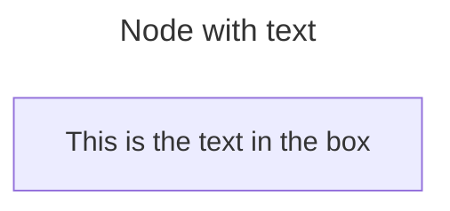
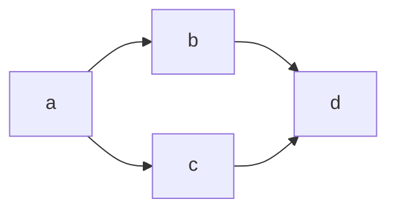
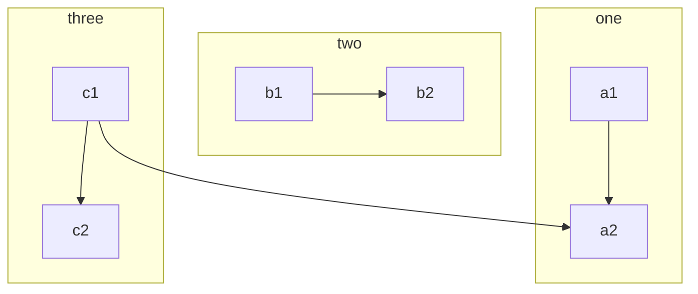

## Syntax

Do not type the word "end" as a Flowchart node. Capitalize all or any one the letters to keep the flowchart from breaking, i.e, "End" or "END". Typing "end" in all lowercase letters will break the Flowchart.  It is also very important to use underscore for multiword descriptors and nodes.  For example, "wake up --> get out of bed" must be "wake_up --> get_out_of_bed" and "begin testing code" must be "begin_testing_code"
If you are using the letter "o" or "x" as the first letter in a connecting Flowchart node, add a space before the letter or capitalize the letter (e.g., "dev--- ops", "dev---Ops").
Typing "A---oB" will create a circle edge.
Typing "A---xB" will create a cross edge.
Typing "A o--o B" or "B <--> C" or "C x--x D" will create a multidirectional arrow.
This is invalid: id1[Design_Creation] -->|Submit_for_Review|> id2[Design_Review].  That should be id1[Design_Creation] -->|Submit_for_Review| id2[Design_Review]. 
IMPORTANT: Never place a > after the |
Be consistent.  If you are using id7 -->|Revise_and_Resubmit| id5 do not suddenly switch to id7 -->|Revise_and_Resubmit].  If it starts with a pipe | it should end with a pipe | not a bracket ]
To render math within a diagram, surround the mathematical expression with the $$ delimiter. If you use sqrt frac etc you must do this.

```mermaid-example
---
 graph LR
      A["$$x^2$$"] -->|"$$\sqrt{x+3}$$"| B("$$\frac{1}{2}$$")
      A -->|"$$\overbrace{a+b+c}^{\text{note}}$$"| C("$$\pi r^2$$")
      B --> D("$$x = \begin{cases} a &\text{if } b \\ c &\text{if } d \end{cases}$$")
      C --> E("$$x(t)=c_1\begin{bmatrix}-\cos{t}+\sin{t}\\ 2\cos{t} \end{bmatrix}e^{2t}$$")
```

```mermaid-example
%%{init: {"flowchart": {"htmlLabels": false}} }%%
flowchart LR
    markdown["`This **is** _Markdown_`"]
    newLines["`Line1
    Line 2
    Line 3`"]
    markdown --> newLines
    ```


```mermaid-example
flowchart LR
   A -- text --> B -- text2 --> C
```





It is possible to style links. For instance, you might want to style a link that is going backwards in the flow. As links have no ids in the same way as nodes, some other way of deciding what style the links should be attached to is required. Instead of ids, the order number of when the link was defined in the graph is used, or use default to apply to all links. In the example below the style defined in the linkStyle statement will belong to the fourth link in the graph:

linkStyle 3 stroke:#ff3,stroke-width:4px,color:red;

It is also possible to add style to multiple links in a single statement, by separating link numbers with commas:

linkStyle 1,2,7 color:blue;

Styling line curves
It is possible to style the type of curve used for lines between items, if the default method does not meet your needs. 
Available curve styles include: basis, bumpX, bumpY, cardinal, catmullRom, linear, monotoneX, monotoneY, natural, step, stepAfter, and stepBefore.


Styling a node
It is possible to apply specific styles such as a thicker border or a different background color to a node.

```mermaid-example
flowchart LR
    id1(Start)-->id2(Stop)
    style id1 fill:#f9f,stroke:#333,stroke-width:4px
    style id2 fill:#bbf,stroke:#f66,stroke-width:2px,color:#fff,stroke-dasharray: 5 5
    ```

