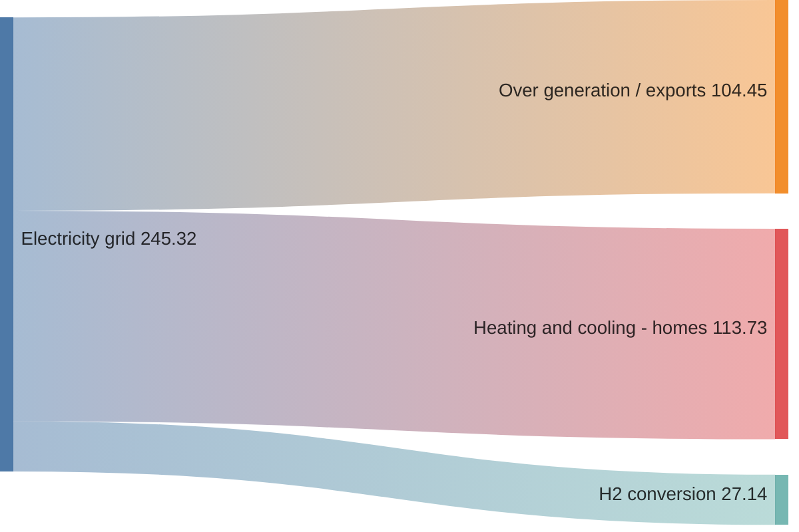
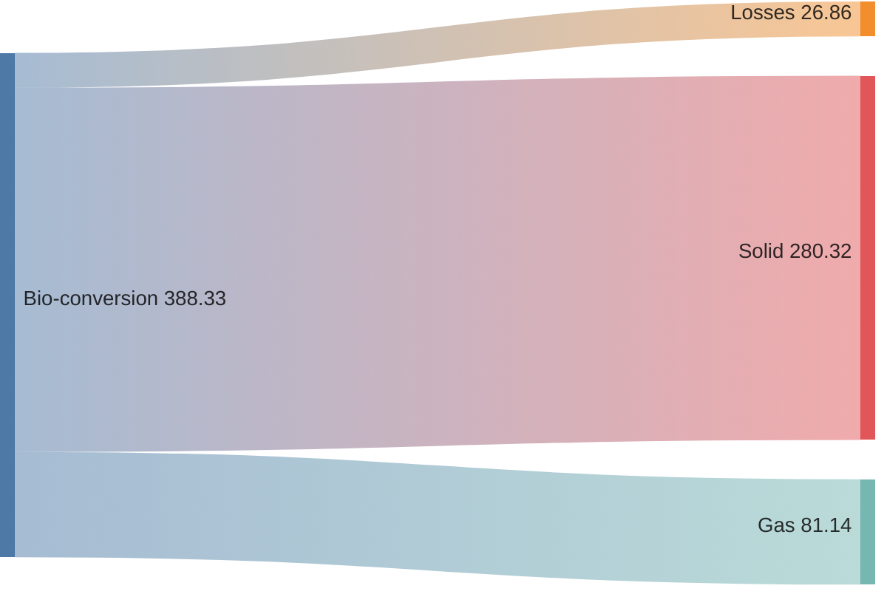
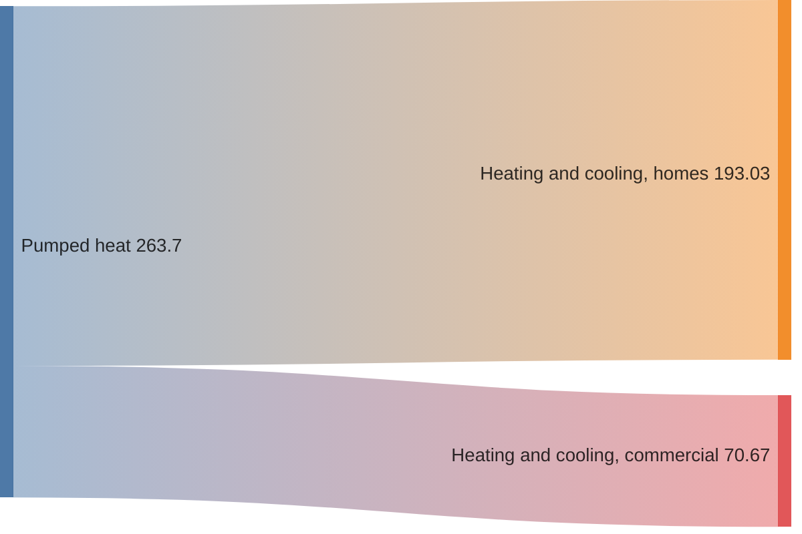
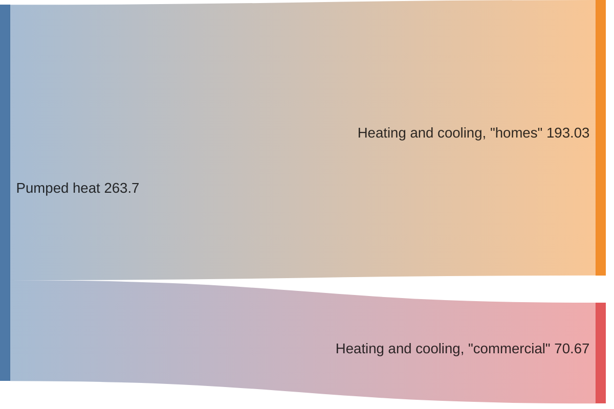

## Syntax

The idea behind syntax is that a user types sankey-beta keyword first, then pastes raw CSV below and get the result.
Do not use more than 10 lines total for source,target,value.

It implements CSV standard as described here with subtle differences:

CSV must contain 3 columns only
It is allowed to have empty lines without comma separators for visual purposes
Basic
It is implied that 3 columns inside CSV should represent source, target and value accordingly

Empty Lines
CSV does not support empty lines without comma delimiters by default. But you can add them if needed

Commas
If you need to have a comma, wrap it in double quotes

Double Quotes
If you need to have double quote, put a pair of them inside quoted string:

