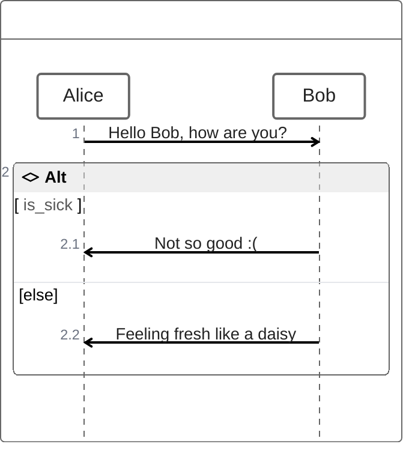

## Syntax

 Note that ZenUML uses a different syntax than the original Sequence Diagram in mermaid.

 ```mermaid-example
zenuml
    title Demo
    Alice->John: Hello John, how are you?
    John->Alice: Great!
    Alice->John: See you later!

```
The participants can be defined implicitly. The participants or actors are rendered in order of appearance in the diagram source text. Sometimes you might want to show the participants in a different order than how they appear in the first message. 

It is possible to specify the actor's order of appearance by doing the following:
 ```mermaid-example
zenuml
    title Declare participant (optional)
    Bob
    Alice
    Alice->Bob: Hi Bob
    Bob->Alice: Hi Alice

```
If you specifically want to use symbols instead of just rectangles with text you can do so by using the annotator syntax to declare participants as per below.
 
 ```mermaid-example
zenuml
    title Annotators
    @Actor Alice
    @Database Bob
    Alice->Bob: Hi Bob
    Bob->Alice: Hi Alice
    ```

The participants can have a convenient identifier and a descriptive label.

 ```mermaid-example
zenuml
    title Aliases
    A as Alice
    J as John
    A->J: Hello John, how are you?
    J->A: Great!

```
Messages can be one of:

Sync message
Async message
Creation message
Reply message
Sync message

You can think of a sync (blocking) method in a programming language.


 ```mermaid-example
zenuml
    title Sync message
    A.SyncMessage
    A.SyncMessage(with, parameters) {
      B.nestedSyncMessage()
    }

```

You can think of an async (non-blocking) method in a programming language. Fire an event and forget about it.

 ```mermaid-example
zenuml
    title Async message
    Alice->Bob: How are you?

```
We use new keyword to create an object.


 ```mermaid-example
 // There are three ways to express a reply message:
zenuml
    // 1. assign a variable from a sync message.
    a = A.SyncMessage()

    // 1.1. optionally give the variable a type
    SomeType a = A.SyncMessage()

    // 2. use return keyword
    A.SyncMessage() {
    return result
    }

    // 3. use @return or @reply annotator on an async message
    @return
    A->B: result
```
The third way @return is rarely used, but it is useful when you want to return to one level up.

 ```mermaid-example
zenuml
    title Reply message
    Client->A.method() {
      B.method() {
        if(condition) {
          return x1
          // return early
          @return
          A->Client: x11
        }
      }
      return x2
    }

```

Sync messages and Creation messages are naturally nestable with {}.

It is possible to express loops in a ZenUML diagram. This is done by any of the following notations:

while
for
forEach, foreach
loop

 ```mermaid-example
zenuml
    Alice->John: Hello John, how are you?
    while(true) {
      John->Alice: Great!
    }


```
It is possible to express alternative paths in a sequence diagram. This is done by the notation



It is possible to render an opt fragment. This is done by the notation
opt {
  ...statements...
}

It is possible to show actions that are happening in parallel.

This is done by the notation
par {
  statement1
  statement2
  statement3
}

It is possible to indicate a stop of the sequence within the flow (usually used to model exceptions).

This is done by the notation

try {
  ...statements...
} catch {
  ...statements...
} finally {
  ...statements...
}