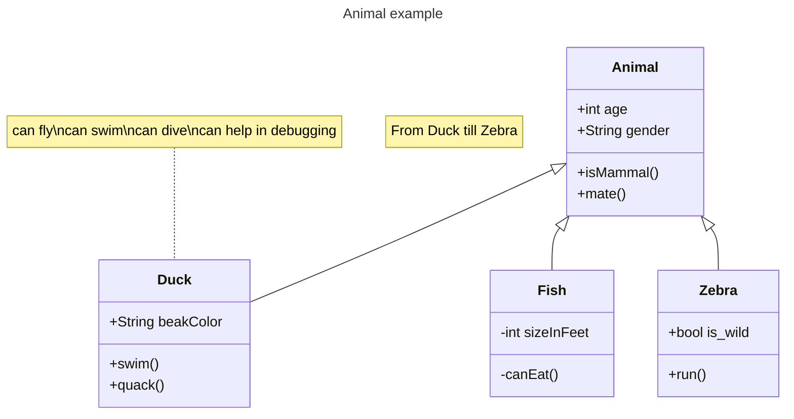

## Syntax

UML provides mechanisms to represent class members, such as attributes and methods, and additional information about them.
A class should be declared without other entries on the same line.  For example, do not use "class FunctionalDesign: Design {" as it is invalid. To show the relationship, create each class separately then use FunctionalDesign --> Design
There are eight different types of relations defined for classes under UML which are currently supported:
| Type    | Description   |
| ------- | ------------- |
| `<\|--` | Inheritance   |
| `*--`   | Composition   |
| `o--`   | Aggregation   |
| `-->`   | Association   |
| `--`    | Link (Solid)  |
| `..>`   | Dependency    |
| `..\|>` | Realization   |
| `..`    | Link (Dashed) |
 Some common annotations include:
- `<<Interface>>` To represent an Interface class
- `<<Abstract>>` To represent an abstract class
- `<<Service>>` To represent a service class
- `<<Enumeration>>` To represent an enum
Annotations are defined within the opening `<<` and closing `>>`.

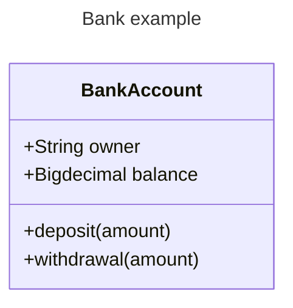

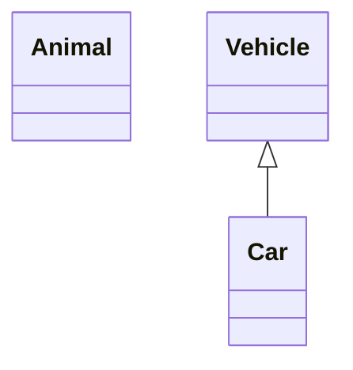

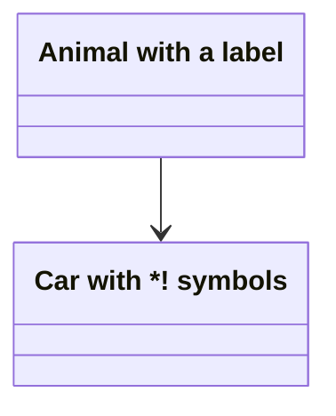
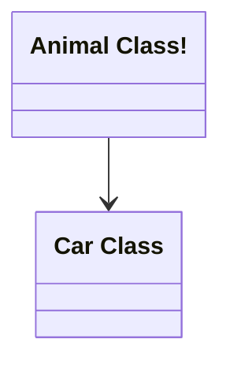
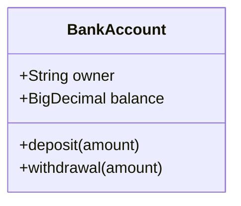

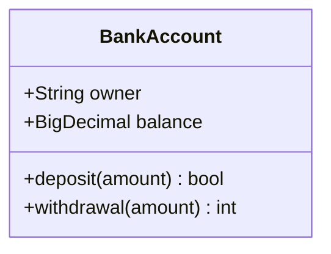

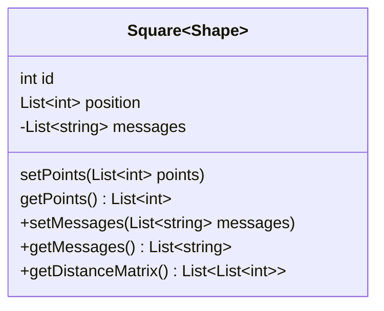
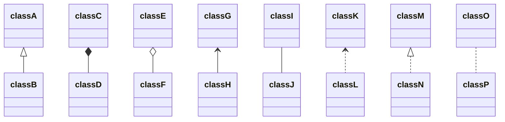

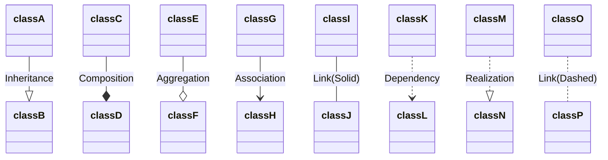

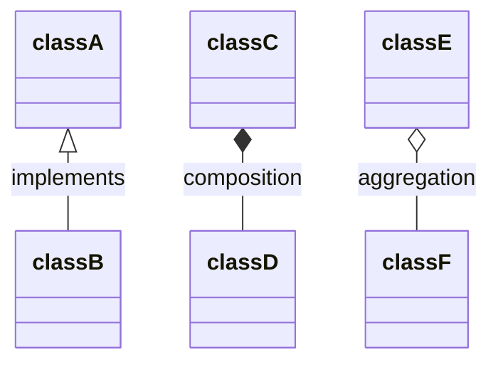

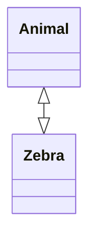

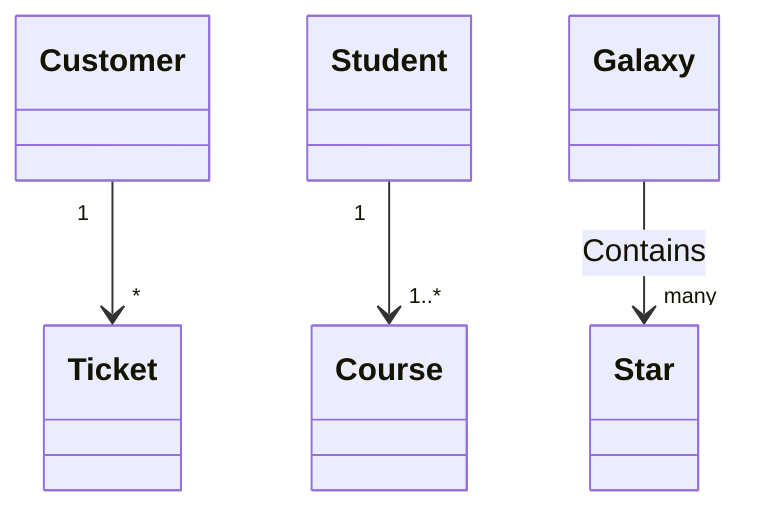
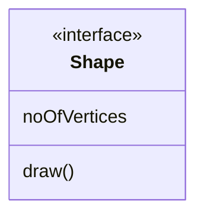
