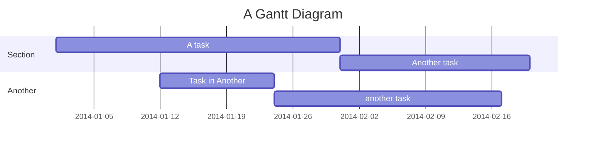
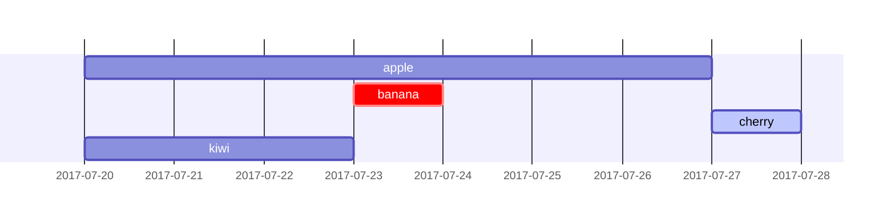
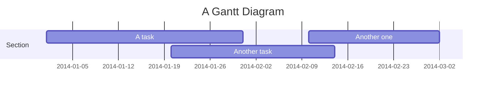

## Syntax

Tasks are by default sequential. A task start date defaults to the end date of the preceding task.

A colon, :, separates the task title from its metadata. Metadata items are separated by a comma, ,. Valid tags are active, done, crit, and milestone. Tags are optional, but if used, they must be specified first. After processing the tags, the remaining metadata items are interpreted as follows:

If a single item is specified, it determines when the task ends. It can either be a specific date/time or a duration. If a duration is specified, it is added to the start date of the task to determine the end date of the task, taking into account any exclusions.
If two items are specified, the last item is interpreted as in the previous case. The first item can either specify an explicit start date/time (in the format specified by dateFormat) or reference another task using after <otherTaskID> [[otherTaskID2 [otherTaskID3]]...]. In the latter case, the start date of the task will be set according to the latest end date of any referenced task.
If three items are specified, the last two will be interpreted as in the previous case. The first item will denote the ID of the task, which can be referenced using the later <taskID> syntax.

Title
The title is an optional string to be displayed at the top of the Gantt chart to describe the chart as a whole.

Section statements
You can divide the chart into various sections, for example to separate different parts of a project like development and documentation.

To do so, start a line with the section keyword and give it a name. (Note that unlike with the title for the entire chart, this name is required.

Milestones
You can add milestones to the diagrams. Milestones differ from tasks as they represent a single instant in time and are identified by the keyword milestone. Below is an example on how to use milestones. As you may notice, the exact location of the milestone is determined by the initial date for the milestone and the "duration" of the task this way: initial date+duration/2.

```mermaid-example
gantt
    dateFormat HH:mm
    axisFormat %H:%M
    Initial milestone : milestone, m1, 17:49, 2m
    Task A : 10m
    Task B : 5m
    Final milestone : milestone, m2, 18:08, 4m

```

