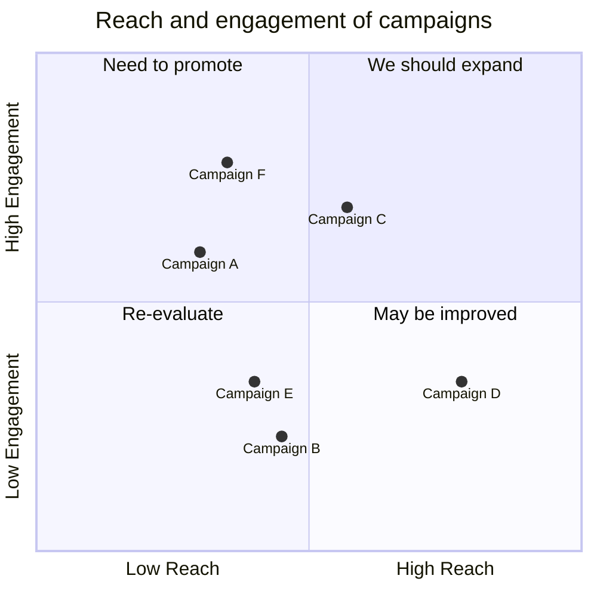

## Syntax

If there are no points available in the chart both axis text and quadrant will be rendered in the center of the respective quadrant. If there are points x-axis labels will rendered from the left of the respective quadrant also they will be displayed at the bottom of the chart, and y-axis labels will be rendered at the bottom of the respective quadrant, the quadrant text will render at the top of the respective quadrant.

For points x and y value min value is 0 and max value is 1.

The x-axis determines what text would be displayed in the x-axis. In x-axis there is two part left and right you can pass both or you can pass only left. The statement should start with x-axis then the left axis text followed by the delimiter --> then right axis text.

Example
x-axis <text> --> <text> both the left and right axis text will be rendered.
x-axis <text> only the left axis text will be rendered.
y-axis
The y-axis determines what text would be displayed in the y-axis. In y-axis there is two part top and bottom you can pass both or you can pass only bottom. The statement should start with y-axis then the bottom axis text followed by the delimiter --> then top axis text.

Example
y-axis <text> --> <text> both the bottom and top axis text will be rendered.
y-axis <text> only the bottom axis text will be rendered.
Quadrants text
The quadrant-[1,2,3,4] determine what text would be displayed inside the quadrants.

Example
quadrant-1 <text> determine what text will be rendered inside the top right quadrant.
quadrant-2 <text> determine what text will be rendered inside the top left quadrant.
quadrant-3 <text> determine what text will be rendered inside the bottom left quadrant.
quadrant-4 <text> determine what text will be rendered inside the bottom right quadrant.
Points
Points are used to plot a circle inside the quadrantChart. The syntax is <text>: [x, y] here x and y value is in the range 0 - 1.

Example
Point 1: [0.75, 0.80] here the Point 1 will be drawn in the top right quadrant.
Point 2: [0.35, 0.24] here the Point 2 will be drawn in the bottom left quadrant.

