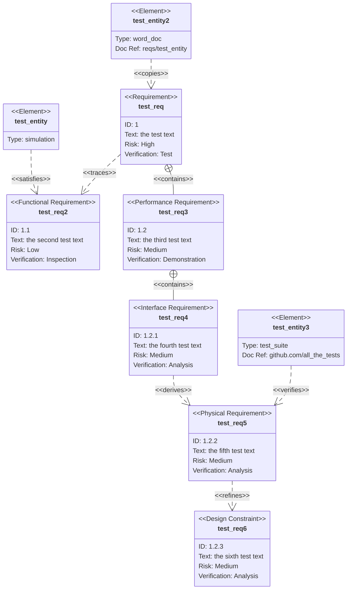

## Syntax

There are three types of components to a requirement diagram: requirement, element, and relationship.
A requirement definition contains a requirement type, name, id, text, risk, and verification method. The syntax follows:
<type> user_defined_name {
    id: user_defined_id
    text: "user_defined text"
    risk: <risk>
    verifymethod: <method>
}
IMPORTANT - THE ONLY VALID KEYWORD OPTIONS ARE THESE. USING OTHER KEYWORDS WILL MAKE THE DIAGRAM UNUSABLE:
Type:	requirement, functionalRequirement, interfaceRequirement, performanceRequirement, physicalRequirement, designConstraint
Risk:	Low, Medium, High
Verification Method:	Analysis, Inspection, Test, Demonstration
Relationship Type:  contains, copies, derives, satisfies, verifies, refines, or traces.
Examples of Valid Relationship Types:
    test_entity - satisfies -> test_req2
    test_req - traces -> test_req2
    test_req - contains -> test_req3
    test_req3 - contains -> test_req4
    test_req4 - derives -> test_req5
    test_req5 - refines -> test_req6
    test_entity3 - verifies -> test_req5
    test_req <- copies - test_entity2

